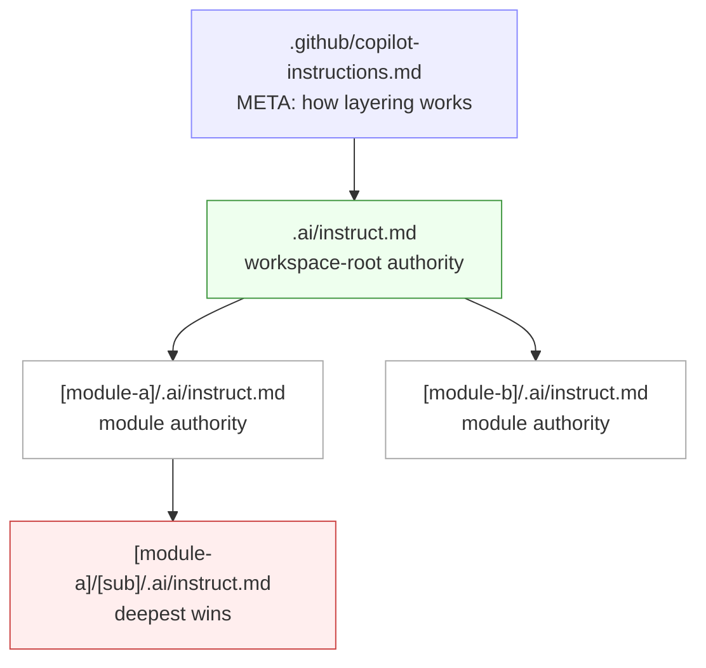
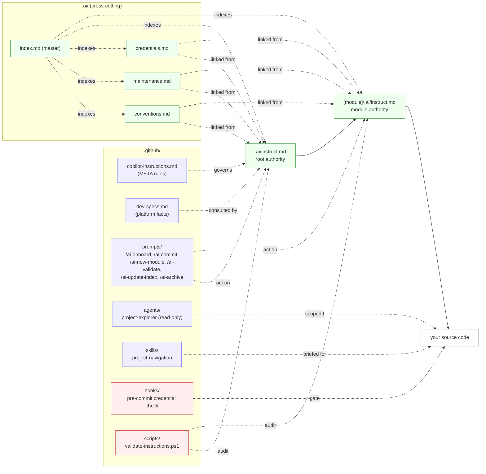

# PDS Layered AI-INSTRUCT Template V3

[](LICENSE)
[](.github/copilot-instructions.md)
[](AGENTS.md)
[](.github/copilot-instructions.md)

> Advanced starter template with **Depth-Priority Hierarchical AI Instructions** for GitHub Copilot Agents, Cursor, Codex, and Aider. Reduces AI hallucinations through per-directory scoped rules where **the deepest file always wins**.

> 📋 **This is the template repository.** After you clone it, run `/ai-onboard` in Copilot Chat — an interactive wizard will replace every placeholder below (`your-project`, repo URL, copyright holder, etc.) with your real values. See [TEMPLATE-USAGE.md](TEMPLATE-USAGE.md) for the full adoption path.

## Executive Summary (30 seconds)

- **Who this is for:** teams using Copilot/Cursor/Codex/Aider who want predictable AI behavior across a real multi-folder codebase.
- **Problem solved:** replaces one giant instruction file with scoped, per-directory rules so agents get local context and make fewer wrong edits.
- **Why V3 matters:** depth-priority layering + onboarding prompts + validation/safety conventions makes the system easier to adopt and safer to scale.

### Simple diagram for non-technical readers

```text
Company coding rules (global)
            │
            ▼
Module rules (team/service specific)
            │
            ▼
Folder rules (task/local edge cases)
            │
            ▼
AI edit output (deepest applicable rule wins)
```

---

## Why this template

This project is built on the **Depth-Priority Hierarchical AI-INSTRUCT V3** system: per-directory `.ai/instruct.md` files where **the deepest file always wins**. Coding agents (Copilot, Codex, Cursor, Aider) get the *right* rules at the *right* scope, automatically.



### How the pieces fit together



Read the **vertical** chain (Meta → Root → Module → Code) as authority. Read the **`.ai/` cross-cutting block** as shared rules that any layer can link to without restating. Read **prompts / agents / skills / hooks / scripts** as tools that act on or audit the system.

What you get out of the box:

- **Layered rules** — global rules in [`.ai/`](.ai/), module-specific overrides per directory.
- **Slash commands** — `/ai-onboard`, `/ai-new-module`, `/ai-archive`, `/ai-update-index`, `/ai-validate`, `/ai-commit`.
- **Custom agents & skills** — read-only exploration agent, navigation skill, room to add your own.
- **Safety built-in** — pre-commit credential block, never-delete + archive convention, never-reset-db rule.
- **Multi-tool ready** — Copilot, Codex (via [AGENTS.md](AGENTS.md)), Cursor (via [`.cursor/rules/`](.cursor/rules/)), Aider.
- **Filled-in examples** — see [`.examples/`](.examples/) for `auth-api` (with real TypeScript code), `data-layer`, and `ui-component` showcases with **before/after** AI behavior.

---

## Best fit / Not fit

### Best fit

- You have a monorepo or modular repo where one global instruction file is too coarse.
- You want a repeatable onboarding flow (`/ai-onboard`) for new contributors.
- You need guardrails for credential safety, archive-first maintenance, and instruction drift checks.

### Not fit

- You only need lightweight prompting for a tiny single-folder prototype.
- Your team does not want to maintain any instruction files beyond one short root note.
- You cannot run basic setup/validation steps during onboarding.

---

## Validation & Status

Add your CI badge(s) here when enabled for your project, for example:

```md
[](https://github.com/OWNER/REPO/actions/workflows/ci.yml)
```

- **Installer checks (`setup.sh` / `setup.ps1`)** install hooks, scaffold `.env`, and run the validator when `pwsh` is available.
- **Safety conventions** include pre-commit credential scanning, blocked staged `.env` files, archive-first maintenance, and never-reset-db guidance.
- **Validation script**: `.github/scripts/validate-instructions.ps1` checks instruction drift, frontmatter sanity, and markdown link integrity.

---

## Realistic before/after walkthrough (text benchmark)

> Synthetic but realistic walkthrough using template examples (no private customer code).

### Scenario A — "Add auth endpoint with role checks"

- **Before (flat instructions):** agent adds route logic directly in controllers, mixes validation, and bypasses repository boundaries.
- **After (V3 layered):** agent follows module-local service/repository split, uses documented auth patterns, and keeps route/service/repository boundaries consistent with the `auth-api` example guidance.

### Scenario B — "Fix schema migration under deadline"

- **Before (ad-hoc prompting):** agent suggests destructive reset shortcuts.
- **After (V3 layered):** agent follows migration conventions and archive/maintenance rules, avoiding unsafe reset recommendations.

### Scenario C — "Refactor UI component variants"

- **Before (tool-only defaults):** inconsistent naming and props shape across related components.
- **After (V3 layered):** naming and structure align with shared conventions + module overrides, reducing rework in review.

---

## Screenshots / GIFs (placeholder for future media)

Until media is added, use these step-by-step references:

1. **`/ai-onboard` flow:** open Copilot Chat → run `/ai-onboard` → confirm detected stack/platform values → apply generated replacements.
2. **Validation flow:** run `pwsh -NoProfile -File .github/scripts/validate-instructions.ps1` (or `/ai-validate`) → fix flagged drift issues → re-run until clean.
3. **Expected visual assets to add later:** onboarding prompt screenshot, validator pass output screenshot, before/after diff GIF.

Suggested alt text for future media:
- `Alt: Copilot Chat showing /ai-onboard questions and detected project defaults`
- `Alt: Terminal output showing AI-INSTRUCT validator checks passing`
- `Alt: Side-by-side before/after AI edit behavior with layered instructions enabled`

---

## Comparison: setup choices

| Setup | What you get | Gaps / tradeoffs |
|---|---|---|
| Plain `copilot-instructions.md` only | Quick start, one central policy file | Weak local context in larger repos; more prompt repetition |
| `AGENTS.md` only | Discovery entrypoint for non-Copilot tools | Not a full scoped rule system by itself |
| Cursor-only rules | Strong Cursor integration | Less portable across Copilot/Codex/Aider workflows |
| **Layered AI-INSTRUCT Template V3** | Depth-priority scoped rules + prompts + validation + safety conventions | Slightly higher initial setup, but better long-term consistency |

---

## Version / Upgrade Notes (V3)

- V3 standardizes depth-priority authority: **deepest matching `instruct.md` wins**.
- V3 formalizes onboarding/maintenance commands (`/ai-onboard`, `/ai-validate`, `/ai-archive`, etc.).
- V3 introduces stronger validator coverage and clearer instruction cross-references.
- If upgrading from a flatter setup, start by migrating root rules to `.ai/instruct.md`, then split module-specific rules into local `.ai/instruct.md` files.

---

## Quick Start

```bash
# 1. Clone this template (or click "Use this template" on GitHub)
git clone https://github.com/vctmasters1/PDS-Layered-AI-Instruct-Template-V3.git your-project
cd your-project

# 2. One-shot setup (installs hooks, scaffolds .env, runs validator)
bash setup.sh             # macOS / Linux / WSL / Git Bash
pwsh setup.ps1            # Windows PowerShell

# 3. Open in VS Code with Copilot, then in Copilot Chat:
#       /ai-onboard
#    (interactive wizard auto-detects defaults and fills in every placeholder)

# 4. Add your project's start commands here once /ai-onboard is done.
```

---

## Project Structure

```
your-project/
├── .github/                     ← AI tooling: instructions, prompts, agents, hooks
│   ├── copilot-instructions.md  ← META: how the .ai/ instruction system works
│   ├── dev-specs.md             ← Dev platform, target platform, frameworks config
│   ├── prompts/                 ← Slash-command prompt files (`/ai-*`)
│   ├── agents/                  ← Custom Copilot agents
│   ├── skills/                  ← Domain knowledge skill packs
│   ├── hooks/                   ← Git hook scripts (run install-hooks.sh / .ps1 to activate)
│   ├── todo/                    ← Project-level TODO list
│   ├── debug/                   ← AI-generated debug scripts (gitignored except README)
│   └── tmp/                     ← Ephemeral output files (gitignored except README)
│
├── .ai/                         ← Global shared instruction files
│   ├── instruct.md              ← Root-level authoritative AI instructions
│   ├── conventions.md           ← Naming and organization rules
│   ├── maintenance.md           ← Archive, never-delete, never-reset-db rules
│   ├── credentials.md           ← Credential warehousing and security rules
│   └── index.md                 ← Master index of all instruction sections
│
├── .vscode/                     ← Shared editor/MCP settings (committed)
├── .dev-docs/                   ← Dev notes for the workspace root (index + .old/)
├── .archive/                    ← Retired files, path-mirrored (read-only reference)
├── .example-module/             ← Bare scaffold for a new module
├── .examples/                   ← Filled-in module showcases (auth-api, data-layer, ui-component)
├── .cursor/rules/               ← Cursor pointer rules → .ai/ (no rule duplication)
│
├── .env.example                 ← Environment variable template (committed)
├── .gitignore
├── AGENTS.md                    ← Discovery anchor for non-Copilot AI agents
├── CHANGELOG.md
├── LICENSE
├── setup.sh / setup.ps1         ← One-shot installer (hooks + .env + validator)
├── TEMPLATE-USAGE.md            ← How to adapt this template to your project
└── README.md                    ← This file
```

---

## Documentation

| Document | Description |
|----------|-------------|
| [.ai/instruct.md](.ai/instruct.md) | Project architecture and rules for AI |
| [.ai/index.md](.ai/index.md) | Master index of all AI instruction sections |
| [TEMPLATE-USAGE.md](TEMPLATE-USAGE.md) | How to adapt this template to your project |
| [CONTRIBUTING.md](CONTRIBUTING.md) | How to contribute safely and consistently |

---

## AI Copilot Quick Reference

This project uses the **Depth-Priority Hierarchical AI-INSTRUCT** system. The authoritative inventory of slash commands, custom agents, and skills lives in [.ai/index.md → Meta & System](.ai/index.md#meta--system). Run `/ai-onboard` in Copilot Chat on a fresh clone to fill in every placeholder.

---

## License

See [LICENSE](LICENSE).
