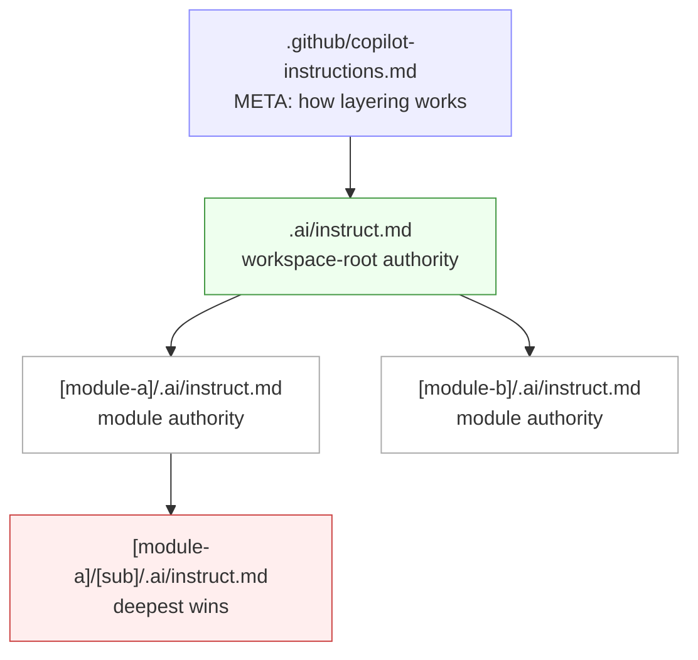
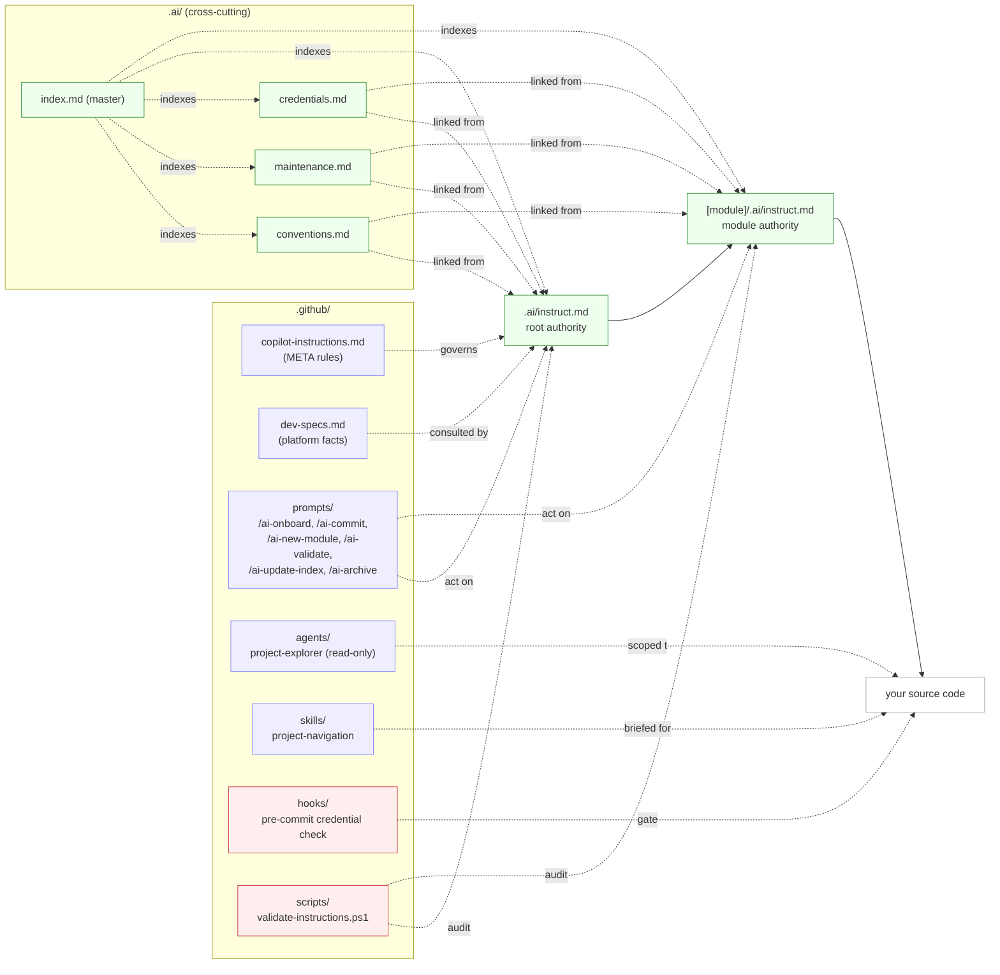

# [PROJECT_NAME]

[](LICENSE)
[](.github/copilot-instructions.md)
[](AGENTS.md)
[](.github/copilot-instructions.md)

> [One-sentence description of what this project does.]

---

## Why this template

This project is built on the **Depth-Priority Hierarchical AI-INSTRUCT V3** system: per-directory `.ai/instruct.md` files where **the deepest file always wins**. Coding agents (Copilot, Codex, Cursor, Aider) get the *right* rules at the *right* scope, automatically.



### How the pieces fit together



Read the **vertical** chain (Meta → Root → Module → Code) as authority. Read the **`.ai/` cross-cutting block** as shared rules that any layer can link to without restating. Read **prompts / agents / skills / hooks / scripts** as tools that act on or audit the system.

What you get out of the box:

- **Layered rules** — global rules in [`.ai/`](.ai/), module-specific overrides per directory.
- **Slash commands** — `/ai-onboard`, `/ai-new-module`, `/ai-archive`, `/ai-update-index`, `/ai-validate`, `/ai-commit`.
- **Custom agents & skills** — read-only exploration agent, navigation skill, room to add your own.
- **Safety built-in** — pre-commit credential block, never-delete + archive convention, never-reset-db rule.
- **Multi-tool ready** — Copilot, Codex (via [AGENTS.md](AGENTS.md)), Cursor (via [`.cursor/rules/`](.cursor/rules/)), Aider.
- **Filled-in examples** — see [`.examples/`](.examples/) for `auth-api` (with real TypeScript code), `data-layer`, and `ui-component` showcases with **before/after** AI behavior.

---

## Quick Start

```bash
# 1. Clone
git clone [repo-url]
cd [project-name]

# 2. One-shot setup (installs hooks, scaffolds .env, runs validator)
bash setup.sh             # macOS / Linux / WSL / Git Bash
pwsh setup.ps1            # Windows PowerShell

# 3. Open in VS Code with Copilot, then in Copilot Chat:
#       /ai-onboard
#    (interactive wizard fills in every [PLACEHOLDER])

# 4. [Add your start commands here]
```

---

## Project Structure

```
[PROJECT_NAME]/
├── .github/                     ← AI tooling: instructions, prompts, agents, hooks
│   ├── copilot-instructions.md  ← META: how the .ai/ instruction system works
│   ├── dev-specs.md             ← Dev platform, target platform, frameworks config
│   ├── prompts/                 ← Slash-command prompt files (`/ai-*`)
│   ├── agents/                  ← Custom Copilot agents
│   ├── skills/                  ← Domain knowledge skill packs
│   ├── hooks/                   ← Git hook scripts (run install-hooks.sh / .ps1 to activate)
│   ├── todo/                    ← Project-level TODO list
│   ├── debug/                   ← AI-generated debug scripts (gitignored except README)
│   └── tmp/                     ← Ephemeral output files (gitignored except README)
│
├── .ai/                         ← Global shared instruction files
│   ├── instruct.md              ← Root-level authoritative AI instructions
│   ├── conventions.md           ← Naming and organization rules
│   ├── maintenance.md           ← Archive, never-delete, never-reset-db rules
│   ├── credentials.md           ← Credential warehousing and security rules
│   └── index.md                 ← Master index of all instruction sections
│
├── .vscode/                     ← Shared editor/MCP settings (committed)
├── .dev-docs/                   ← Dev notes for the workspace root (index + .old/)
├── .archive/                    ← Retired files, path-mirrored (read-only reference)
├── .example-module/             ← Bare scaffold for a new module
├── .examples/                   ← Filled-in module showcases (auth-api, data-layer, ui-component)
├── .cursor/rules/               ← Cursor pointer rules → .ai/ (no rule duplication)
│
├── .env.example                 ← Environment variable template (committed)
├── .gitignore
├── AGENTS.md                    ← Discovery anchor for non-Copilot AI agents
├── CHANGELOG.md
├── LICENSE
├── setup.sh / setup.ps1         ← One-shot installer (hooks + .env + validator)
├── TEMPLATE-USAGE.md            ← How to adapt this template to your project
└── README.md                    ← This file
```

---

## Documentation

| Document | Description |
|----------|-------------|
| [.ai/instruct.md](.ai/instruct.md) | Project architecture and rules for AI |
| [.ai/index.md](.ai/index.md) | Master index of all AI instruction sections |
| [TEMPLATE-USAGE.md](TEMPLATE-USAGE.md) | How to adapt this template to your project |

---

## AI Copilot Quick Reference

This project uses the **Depth-Priority Hierarchical AI-INSTRUCT** system. The authoritative inventory of slash commands, custom agents, and skills lives in [.ai/index.md → Meta & System](.ai/index.md#meta--system). Run `/ai-onboard` in Copilot Chat on a fresh clone to fill in every placeholder.

---

## License

See [LICENSE](LICENSE).
